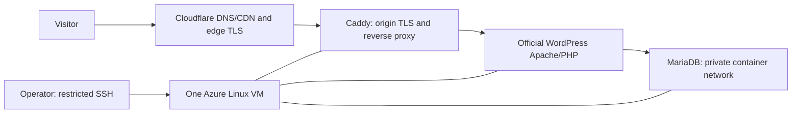

# Glowwise infrastructure plan

Prepared 9 October 2026. Stage 1 design retained below as planning provenance. **Stage 2 is now deployed:** Korea Central B2ats v2 x64, Trusted Launch Ubuntu 24.04, pinned Compose/WordPress/MariaDB/Caddy, active Cloudflare DNS/strict HTTPS and private recovery. Present-tense operational truth is in [Stage 2](Stage_2_2026-10-09.md), [operations](OPERATIONS.md), [cost ledger](COST_LEDGER.md) and [actual evidence](../References/Deployment/Evidence_Index.md). References below to pending selection/no resources describe the earlier design gate, not current state. Product authority: Source of Truth v1.1; task gates: `../Implementation/EXECUTION_PLAN.md`.

## Selected topology

One project resource group, one adequately sized Linux VM, one OS disk, NIC, NSG, VNet/subnet and the minimum required public IP. Do not add managed database, load balancer, Redis, paid monitoring, marketplace software or a second server by default. Candidate OS: Ubuntu 24.04 LTS x64, subject to current image availability and Docker support. Size and region remain unresolved; recheck B2ats v2, B1s and other eligible configurations without extrapolating the earlier bounded failures. A free meter alone does not prove capacity, benefit matching or adequate memory. ARM is eligible only after every chosen image and build dependency is confirmed compatible.

WordPress currently recommends PHP 8.3+ and MariaDB 10.11+ (or MySQL 8.0+). Pin mutually supported image versions and digests during setup, then record actual PHP/database/WordPress/Caddy/Compose versions. Do not use an unreviewed `latest` deployment. [WordPress requirements](https://wordpress.org/about/requirements/), [official WordPress image](https://raw.githubusercontent.com/docker-library/docs/master/wordpress/README.md), [Docker Ubuntu installation](https://docs.docker.com/engine/install/ubuntu/).

## Network, storage and development

- NSG: SSH 22 restricted to the operator's current approved source; public TCP 80/443 for the website and ACME. Restrict administration further after bootstrap. No published MariaDB 3306 or direct Apache port. Use a private Compose network and Caddy-to-WordPress upstream.
- Docker-published traffic can bypass UFW rules; NSG and actual external port checks are part of acceptance. Do not rely on UFW alone. [Docker firewall behavior](https://docs.docker.com/engine/network/packet-filtering-firewalls/).
- Planned VM working copy: `/srv/glowwise/source`; secrets outside that checkout with restricted permissions. A later `deploy/` directory in this single repository holds Compose, Caddy and runbooks. No duplicate application repository is needed.
- Develop and build assets on the VM. Local editing/source synchronization and read-only document tooling are allowed. Node is a build dependency only if the asset pipeline needs it; no permanent Node website server.
- Keep the custom theme and `glowwise-core` source tracked; WordPress core, dependencies, uploads, database, cache and Caddy state are runtime data. Persist WordPress content/uploads, MariaDB data, and Caddy `/data` and `/config`; record volume ownership, health checks, restart policy and bounded log rotation. Verify restart persistence and update rollback.
- WordPress receives HTTPS through the proxy. Configure trusted forwarded protocol/host handling and canonical site URLs, then test for redirect loops and secure cookies. Do not blindly trust arbitrary client-supplied proxy headers.
- Protect development from public use with authentication and indexing controls, while allowing the specific ACME challenge route. Remove protection only at the authorized launch gate. Do not confuse robots exclusion with access control.

## Domain and TLS

Use `glowwise.tech`, with `www` redirected consistently to the chosen apex canonical. Inspect existing records first; add only the records required by the actual allocated origin and preserve unrelated records. Confirm authoritative/public propagation, not merely a dashboard save. DNS-only bootstrap is a routine option if proxying interferes with validation; record any transition to proxied mode.

Caddy's public HTTPS uses ACME; explicitly configure **Let's Encrypt** as the CA rather than depending on default issuer fallback. Persist certificate state, keep challenge traffic reachable on 80/443, and test the issued SANs, issuer, expiry, renewal configuration and edge-to-origin behavior. Caddy manages issuance/renewal; **Certbot is not selected or installed**. Cloudflare Full (strict) requires a valid matching origin certificate. Edge TLS and origin TLS are distinct evidence. [Caddy automatic HTTPS](https://caddyserver.com/docs/automatic-https), [Caddy TLS configuration](https://caddyserver.com/docs/caddyfile/directives/tls), [Cloudflare Full (strict)](https://developers.cloudflare.com/ssl/origin-configuration/ssl-modes/full-strict/).

The handbook's “Let's Encrypt / Certbot” criterion will be supported with the actual Let's Encrypt installation and renewal mechanism. Do not promise an instructor's interpretation. If literal Certbot is required, use the documented webroot/PEM-mount alternative in `../Implementation/DECISIONS.md`, preserving Caddy as proxy and the selected stack. No change is needed now.

## Cache and security defaults

WP Super Cache provides public HTML caching. Initially keep Cloudflare HTML caching conservative; bypass admin/login, previews, authenticated sessions, contact submissions, REST requests and private/utility responses as appropriate. Cache versioned static assets; test stale-content purge and cookie behavior. Do not introduce a blanket cache-everything rule. Build-time minification is the documented equivalent for retired Cloudflare Auto Minify. [Cloudflare deprecations](https://developers.cloudflare.com/fundamentals/api/reference/deprecations/), [WP Super Cache](https://wordpress.org/plugins/wp-super-cache/).

Use key-based non-root administration, restricted secret files, unique database credentials, timely OS/container/plugin updates, least-privilege WordPress roles, rate/spam controls and privacy-safe logs. Do not put analytics personal data or a student account email in public pages, source or evidence. Keep a redacted operational summary separate from raw account output.

## US$10 lifetime cost gate

The ceiling includes credit-funded consumption. Current portal totals are a snapshot and may lag; no present estimate is a quote for an unselected VM.

| Line item | Stage 1 finding | Required before creation |
|---|---|---|
| Linux compute | Free panel lists B1s, B2ats v2 and B2pts v2, each 0/750 hours used. | Exact region, size, architecture, security profile, quota/capacity and benefit match; actual rate if excluded or exceeded. |
| Managed OS disk | Panel lists P6 disk allowance, not an allocated disk. | Image disk size, chosen disk SKU/capacity, applicable allowance and retention rate. Avoid extra data disks. |
| Public IP | Panel lists 0/1,500 hours; SKU applicability unverified. | Exact supported SKU and benefit/rate. Include retained allocation after VM stop. |
| Network | Panel lists egress 0/15 GB. | Regional transfer terms and expected allowance/overage; no paid gateway. |
| Backup/log storage | None created. | Retained bytes/location/duration and cost; prefer existing approved storage without paid service. |
| Other resources/tax/currency | No project resources displayed. | Full create-summary review, no optional paid add-ons, billing currency and USD comparison. |

Record an itemized hourly/monthly estimate, benefit expiry and **finite run/retention window**. Calculate lifetime exposure as consumed cost + planned runtime cost + retained disk/IP/storage cost + uncertainty buffer. A US$2 reserve and US$8 operating threshold are planning controls, not a new allowance or provider-enforced limit. At that threshold, stop new allocation and resolve remaining exposure before continuing. No automatic destructive deletion is authorized by this plan.

Preserve subscription spending protection and verify its actual state. Azure does not provide a configurable custom US$10 spending limit; budget alerts are delayed, period-based and do not stop resources. Record cumulative lifetime consumption separately from monthly reports. VM deallocation removes compute billing in applicable states but can retain disk/network charges. Do not equate “Stop” with zero project cost. [Spending limits](https://learn.microsoft.com/en-us/azure/cost-management-billing/manage/spending-limit), [budget behavior](https://learn.microsoft.com/en-us/azure/cost-management-billing/costs/tutorial-acm-create-budgets), [VM states and billing](https://learn.microsoft.com/en-us/azure/virtual-machines/states-billing).

If the exact candidate cannot fit US$10 with a defensible buffer and lifecycle, pause before creation and present the concrete estimate and required tradeoff. No card, paid upgrade, additional domain or unrelated paid service. This stage creates no alert automation or billable control resource.

## Backup, evidence and acceptance

UpdraftPlus Free is selected for full site/database backups. Keep production backups private and outside Git, with an approved off-VM recovery copy. Test restoration in an isolated directory/database on the same VM only if capacity permits; otherwise resolve a cost-compliant test method before claiming recovery. The coursework public Drive bundle must be separately sanitized and restore-tested; a real private inbox/database must never be made public. [UpdraftPlus](https://wordpress.org/plugins/updraftplus/).

Record dated redacted SSH/service/version logs, deployment revision, NSG/port checks, resource/cost register, origin/edge certificate checks, cache behavior, persistence and restore results. Planned evidence directories in the execution plan are not existing proof. Infrastructure acceptance is T02–T05 and T14; product acceptance remains separate.
