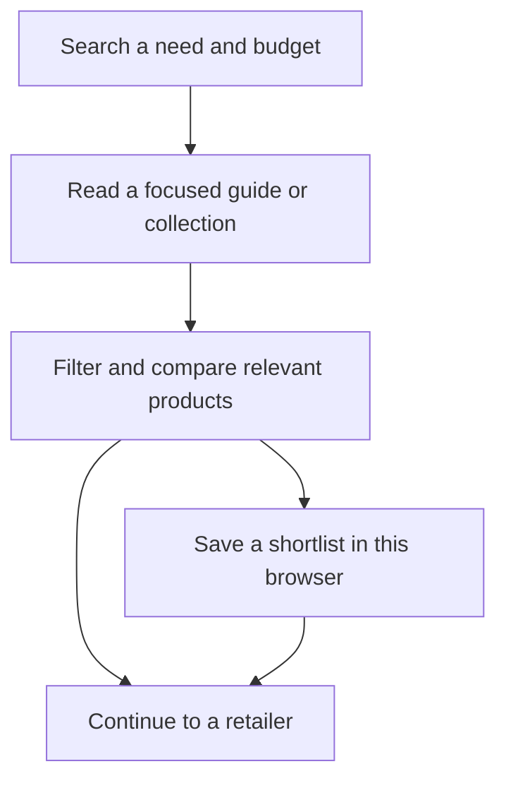

# Glowwise — Niche, Target Audience & SEO Problem Identification

**Milestone 1 · Criterion 1 · 2 marks**  
**Course:** CSET489 SEO Mini Project  
**Research and evidence captured:** 8 October 2026  
**Product reference:** [Glowwise Source of Truth](../../GLOWWISE_SOURCE_OF_TRUTH.md)

> **Selected niche:** Affordable grooming product discovery and buying guidance for Indian young adults, approximately 18–30, across genders, using English-language content.

## 1. Assessment requirement

The supplied handbook requires a defined evergreen niche or trending topic, audience personas, search intent patterns, clear SEO problem statements, and a **100–150-word justification supported by data**. This document addresses that criterion; detailed keyword metrics and competitor analysis belong to their subsequent deliverables.

| Required element | Evidence in this document |
|---|---|
| Specific niche and its relevance | Sections 2–4: scope, justification and market evidence |
| Defined target audience and personas | Section 5: audience boundaries and proposed personas |
| Search intent patterns | Section 6: intent, illustrative queries and appropriate responses |
| Clear SEO problems | Section 7: evidence, interpretation and planned response |
| Supporting research and evidence | Sections 9–10: sources and five original screenshots |

## 2. Niche definition and boundaries

Glowwise addresses a recurring purchase decision: **“Which grooming product fits my needs and budget, and why should I choose it?”** Its focus combines an Indian market, a young adult audience, affordability and practical comparison. These constraints give the six product categories a common purpose.

| Category | Decision Glowwise helps a visitor make |
|---|---|
| Skincare | Compare product formats, stated attributes, pack sizes and checked prices for a stated preference. |
| Haircare | Understand differences between products and select a manageable routine within budget. |
| Bodycare | Compare everyday cleansing and moisturising choices using understandable information. |
| Fragrance | Understand scent descriptions, formats and price differences before shortlisting. |
| Beard and men’s grooming | Compare maintenance products and understand their intended uses. |
| Grooming tools | Compare verified specifications such as length settings, runtime and cleaning requirements. |

**Positioning:** Budget and midrange choices lead. Premium alternatives need an explained benefit. Glowwise provides researched guidance, a structured catalog, comparisons and saved shortlists; purchases take place through real retailer links.

**Evergreen rationale:** Routine care, product replacement and constrained purchase decisions recur beyond a single launch or social trend. This is a reasoned niche selection, not a claim that Google Trends or search-volume data has already established stable demand. Individual products, prices and search terms will still require updates and validation.

**Editorial boundaries:** Content must explain sources and limitations. Research-based selections must not imply firsthand testing, clinical expertise or guaranteed outcomes. The site does not diagnose conditions or operate a checkout. These boundaries follow the approved Source of Truth.

## 3. Data-supported justification — 138 words

<!-- justification:start -->
Glowwise focuses on affordable grooming product discovery for Indian adults aged approximately 18–30 across genders. Its niche combines practical buying guidance with budget and midrange product comparisons. Bain and Flipkart’s 2026 report estimates that Gen Z accounts for 40–45% of India’s e-retail shoppers, providing context for a young audience focus. NIQ’s 2025 Indian beauty overview highlights ingredient transparency, digital discovery and price clarity, supporting understandable, sourced recommendations. The SEO problem is connecting specific need-and-budget searches with useful pages that explain suitability, limitations and checked prices. Glowwise will combine original guides, a filterable catalog, consistent comparisons and saved shortlists, with complete mobile and desktop support. This gives visitors a practical route from research to retailer selection. Long-tail informational and commercial queries are an initial research direction; their demand, difficulty and competitive opportunity require validation before keyword targets are finalised.
<!-- justification:end -->

**Supporting data:** [Bain/Flipkart, 2026](https://www.bain.com/insights/how-india-shops-online-2026/) and [NIQ, 2025](https://nielseniq.com/global/en/insights/report/2025/the-new-face-of-indian-beauty/). The 18–30 age range is Glowwise’s approved product choice; Bain’s broader Gen Z cohort is contextual evidence rather than an exact audience match.

## 4. Research supporting the niche

| Finding | Product implication | Interpretation limit |
|---|---|---|
| Bain/Flipkart estimates Gen Z represents **40–45% of Indian e-retail shoppers**. | A young audience is a relevant starting point for online product discovery. | General e-retail, not grooming alone. The report defines Gen Z as people born in 1997–2012, including people outside Glowwise’s adult age range. |
| The same report attributes approximately **65% of new shoppers to Tier 2 and smaller cities**. | Research and examples should consider Indian shoppers beyond the largest cities. | A share of new e-retail shoppers, not all shoppers or a grooming-specific audience measure. |
| NIQ’s public beauty overview highlights ingredient transparency, digital discovery, price clarity and skin-tone compatibility. | Explain relevant attributes, selection reasons and price sources clearly. | Qualitative findings from a public overview; they do not quantify confusion among Glowwise’s exact audience. |
| NIQ’s male grooming overview describes young men’s interest extending into skincare and ingredient-led products. | Include men within the broader grooming audience and avoid treating skincare as relevant to only one gender. | Supports inclusion; it does not establish the demographic mix of Glowwise’s future visitors. |

Sources: [Bain/Flipkart](https://www.bain.com/insights/how-india-shops-online-2026/), [NIQ Indian beauty overview](https://nielseniq.com/global/en/insights/report/2025/the-new-face-of-indian-beauty/), [NIQ male grooming overview](https://nielseniq.com/global/en/insights/report/2025/genz-male-grooming/).

## 5. Target audience and proposed personas

### Primary audience

- **Location:** India, with prices in INR and links relevant to Indian purchasing.
- **Age and inclusion:** Approximately 18–30, across genders; students and early-career adults are useful initial audience hypotheses.
- **Language:** English for the initial release and keyword research.
- **Purchase context:** Budget or midrange consideration, unfamiliar product terminology, and a need to compare before buying.
- **Experience requirement:** Equal access to complete functionality on mobile and desktop. Reading, filtering, comparison, saving and retailer navigation must all work properly on both.

These boundaries are product decisions informed by desk research. They are not findings from a completed user survey.

### Proposed personas

The following personas are **research-informed design hypotheses**. Their ages and scenarios are illustrative; no interviews, income measurements or behavioural percentages are being claimed.

| Persona | Goal and likely difficulty | Illustrative search | Required Glowwise response |
|---|---|---|---|
| **First-routine learner**, approximately 18–22 | Build an understandable starter routine without purchasing unnecessary products; struggles with terminology and product order. | “simple grooming routine for beginners India” | A clear guide, explanations of product roles, optional steps and relevant affordable choices. |
| **Value-conscious comparator**, approximately 21–27 | Shortlist suitable options within a firm budget; struggles to reconcile recommendations, variants and changing prices. | “best sunscreen for oily skin under 500 India” | A focused guide and eligible product collection, checked prices, pack sizes, limitations and consistent comparison fields. |
| **Practical grooming buyer**, approximately 23–30 | Replace or purchase a useful grooming tool; struggles to compare specifications and distinguish necessary features from marketing. | “beard trimmer under 1500 cordless” | A specification-based comparison, source links and an explained shortlist with relevant trade-offs. |

The sunscreen query above was also used for the live search observation in Section 7. The other examples illustrate intent; none is presented as a validated target keyword or a measured query volume.

## 6. Search intent patterns

| Intent | Visitor’s question | Illustrative query | Appropriate page or action |
|---|---|---|---|
| **Informational** | “What do I need, and what does this term mean?” | “how to start a basic skincare routine” | An accessible guide with definitions, limitations and links to relevant product types. |
| **Commercial investigation** | “Which option should I choose within my constraints?” | “best sunscreen for oily skin under 500 India” | A need-specific buying guide connected to a budget-filtered collection and comparison tool. |
| **Transactional** | “Where can I purchase the option I have chosen?” | “buy [product name] India” | A sourced product page with a real retailer destination and accurate price-check information. |
| **Navigational** | “How do I return to this brand or tool?” | “Glowwise product finder” | Clear branded navigation and an accessible finder. This is a future branded-query example, not evidence of existing demand. |

**Intended journey:** Visitors can enter through a guide or collection, understand their options, compare products, save a shortlist and continue to a retailer. They may also arrive directly on a product page. No account is required for the local browser shortlist.

This is the planned experience, not evidence that those features have been implemented.

## 7. SEO problem identification

### Central problem statement

**Glowwise must earn discovery for specific Indian grooming needs and budgets, then provide a transparent, usable answer that helps a visitor choose.** As a new, unlaunched site, it has no demonstrated organic visibility or performance baseline. The challenge is establishing useful, discoverable content and trust, rather than repairing an already measured ranking decline.

### Problem 1 — Precise budget intent needs consistent answers

**Observed evidence:** On 8 October 2026, Nykaa’s “Under 500 Sunscreens” category displayed a price table containing Neutrogena Ultrasheer SPF 50+ at **₹599**. The captured table also showed an update date of 8 October 2026. See Evidence E05 and the [source page](https://www.nykaa.com/best-sunscreens-online-sale/best-under-500-sunscreens-products-online-sale/c/6779).

**Interpretation:** This is a concrete example of a displayed price exceeding a page’s stated budget. Variants, promotions or subsequent updates may affect the explanation; one observation does not establish a site-wide problem. Nykaa also provides useful filters, including price and skin type, which must be acknowledged.

**Glowwise response:** Align page titles, budget filters and listed variants. Record pack size, price source and check date. An item above the stated threshold must be excluded from the qualifying shortlist or clearly presented as an above-budget alternative. Retailer checkout remains the final price authority.

### Problem 2 — Recommendations need understandable evidence

**Research basis:** NIQ identifies transparency and price clarity as relevant themes. Google’s guidance asks publishers to create useful content for a clear audience and make authorship and production methods understandable. These sources support an editorial requirement, not a quantified claim that all competing guides are unreliable. [NIQ](https://nielseniq.com/global/en/insights/report/2025/the-new-face-of-indian-beauty/), [Google](https://developers.google.com/search/docs/fundamentals/creating-helpful-content).

**Glowwise response:** Explain who a selection may suit, what factual sources support it, its limitations and why alternatives differ. Identify Glowwise Editorial and the selection method. Avoid unsupported superlatives, medical promises and claims of hands-on testing.

### Problem 3 — A new site must compete with established search formats

**Observed evidence:** An English Google search using India parameters for “best sunscreen for oily skin under 500 India” displayed sponsored products, an AI overview, videos, a Reddit discussion, retailer and brand pages, and a buying-guide result. Evidence E03–E04 records this single search context.

**Interpretation:** Existing content already serves this topic. A general “best grooming products” proposition alone does not establish a competitive advantage. Search appearances are variable; this snapshot proves neither keyword difficulty nor achievable rankings, and AI-generated summaries were not used as product evidence.

**Glowwise response:** Investigate specific combinations of product type, need and budget. Match each selected query to a useful page, with clear titles, readable structure and internal links. Validate demand and competition in the subsequent keyword and competitor criteria before committing targets. [Google SEO Starter Guide](https://developers.google.com/search/docs/fundamentals/seo-starter-guide).

### Problem 4 — Six categories need one coherent purpose

**Product analysis:** A broad catalog could weaken editorial focus if every category pursues unrelated trends. This is an architectural risk identified from Glowwise’s scope, not a measured search penalty.

**Glowwise response:** Apply the same affordable, understandable decision framework across all categories. Organise guides and collections around product types and concrete purchase questions, and connect them to consistent product information. Mobile users must receive the same evidence and decision tools as desktop users.

## 8. Resulting opportunity and next decisions

Glowwise’s proposed value is the combination of **clear buying guidance, checked product information and practical comparison tools**. Retailer filters and buying guides already exist; the opportunity is to execute this combination coherently for the chosen audience. A competitive gap has not yet been proven.

The next criterion should validate English-language keyword demand in India, assess relevant difficulty and intent, and prioritise realistic page topics. Later competitor research should examine the actual quality and coverage of competing pages. User feedback should then challenge the proposed personas and reveal whether explanations and tools resolve real decisions.

This criterion establishes **who Glowwise serves, the purchase problem it addresses, the relevant search intentions and the SEO questions to validate next**. It makes no claim of achieved rankings, traffic, conversions or awarded marks.

## 9. References

All web sources were accessed on **8 October 2026**. NIQ sources below are their publicly accessible overviews; the complete underlying reports were not reviewed.

1. **Bain & Company / Flipkart.** *How India Shops Online 2026.* Published 8 April 2026. Audience context and e-retail figures. [Read report](https://www.bain.com/insights/how-india-shops-online-2026/).
2. **NielsenIQ.** *The New Face of Indian Beauty.* Published 26 June 2025. Public overview of transparency and discovery themes. [Read overview](https://nielseniq.com/global/en/insights/report/2025/the-new-face-of-indian-beauty/).
3. **NielsenIQ.** *Gen Z Male Grooming.* Published 26 June 2025. Public overview supporting the relevance of men within the grooming audience. [Read overview](https://nielseniq.com/global/en/insights/report/2025/genz-male-grooming/).
4. **Google Search Central.** *Search Engine Optimization (SEO) Starter Guide.* Supplied course reference; supports discoverable, useful page organisation. [Read guide](https://developers.google.com/search/docs/fundamentals/seo-starter-guide).
5. **Google Search Central.** *Creating helpful, reliable, people-first content.* Supports audience focus, transparency and original value. [Read guidance](https://developers.google.com/search/docs/fundamentals/creating-helpful-content).
6. **Nykaa.** *Under 500 Sunscreens.* Live category and displayed price-table observation. [View page](https://www.nykaa.com/best-sunscreens-online-sale/best-under-500-sunscreens-products-online-sale/c/6779).
7. **Google Search.** Contextual observation for the exact sunscreen query in Section 7; English language and India parameters. [Repeat query](https://www.google.com/search?q=best+sunscreen+for+oily+skin+under+500+India&hl=en&gl=in). This is an observation record, not a source of verified product claims or keyword metrics.
8. **Supplied course materials.** [Mini-Project Handbook](<../../Reference/Mini-Project Handbook.docx>) and [Milestone details and reference links](<../../Reference/Milestone 1 and 2 details with reference material links.md>). These establish assessment requirements. The [Source of Truth](../../GLOWWISE_SOURCE_OF_TRUTH.md) establishes approved product decisions.

**Research limits:** No original audience interviews, measured keyword volumes, keyword difficulty scores, representative SERP sample or live-site audit are claimed. Historical metrics in the unfinished draft were not reused as current findings. The screenshots preserve dated observations; live results and prices may change.

## 10. Evidence appendix

Original browser captures and their source mapping are recorded in the [Evidence Index](<../References/Milestone 1/01 Niche Audience SEO Problem/Evidence_Index.md>).

### E01 — Young audience context

Bain/Flipkart’s 2026 report, showing its Gen Z e-retail finding. This supports market context, not the exact age or gender composition of Glowwise’s future audience.

### E02 — Transparency and discovery themes

NIQ’s public Indian beauty overview, showing the relevance of ingredient transparency, digital discovery and price clarity.

### E03 — Search context above the organic results

The observed sunscreen query, showing sponsored products and an AI overview. These were inspected as search formats, not relied on for product recommendations.

### E04 — Existing search-result formats

Another viewport from the same query, recording existing result formats and sources. No position or difficulty measurement is inferred.

### E05 — A precise budget consistency example

Nykaa’s under-₹500 sunscreen category and its displayed ₹599 entry. This is a narrow, dated observation supporting Glowwise’s proposed price-consistency requirement.

